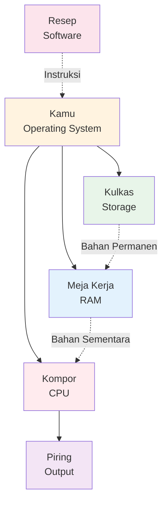

### Komputer itu Apa Sih?

*Photo by [Kari Shea](https://unsplash.com/@karishea) on [Unsplash](https://unsplash.com)*

**Definisi simple**: Komputer itu mesin yang bisa **nyimpen data**, **proses data**, dan **nampilin hasil** dengan cepat. Segitu doang.

**Analogi: Dapur**

> Bayangin kamu masak nasi goreng:
> - **Bahan (data)**: nasi, telur, bumbu (ini data yang mau diproses)
> - **Kompor + wajan (processor)**: alat buat masak (process data)
> - **Kulkas (storage)**: tempat simpen bahan (long-term storage)
> - **Meja kerja (RAM)**: tempat naruh bahan yang lagi dipake (short-term, working memory)
> - **Piring (output)**: hasil masakan yang siap disajikan (display/print)
> - **Resep (software)**: instruksi cara masaknya (program/code)
> - **Kamu (operating system)**: yang koordinasi semua (ambil bahan dari kulkas, taruh di meja, nyalain kompor, dll)

Komputer kerja persis kayak gini, cuma jauh lebih cepat (milyaran operasi per detik).

<!-- DIAGRAM: Kitchen Analogy -->

*Diagram: Analogi dapur - gimana komponen komputer kerja bareng*

**📹 Video Explanation:**

<figure><figcaption><em>CPU, RAM, dan Storage explained dengan analogi dapur</em></figcaption></figure>

---