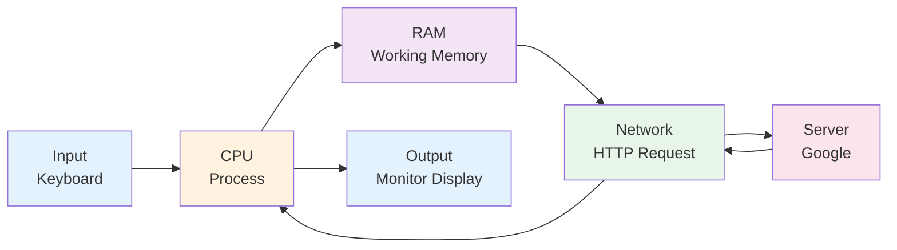

### Putting It All Together: Workflow Komputer

**Scenario**: Kamu buka Chrome, ketik "google.com", enter.

**What happens** (simplified):

1. **Input**: Kamu ketik di keyboard → OS detect keystroke → pass ke Chrome.
2. **Process**:
   - Chrome (app) minta OS: "Gue butuh RAM 500 MB buat load page ini."
   - OS alokasi RAM dari pool available.
   - Chrome kirim HTTP request ke google.com (via network card).
   - Google server bales dengan HTML/CSS/JS.
3. **CPU works**:
   - Parse HTML (CPU baca struktur page).
   - Render CSS (hitung layout, warna, font).
   - Execute JavaScript (animasi, interaktif).
4. **GPU works** (kalau ada):
   - Render visual (gambar, video) ke pixel.
5. **Output**: Monitor nampilin Google homepage.

**Total time**: <1 detik (miliaran instruksi dieksekusi).

<!-- DIAGRAM: Computer Workflow -->

*Diagram: Computer workflow ketika buka google.com*

**📹 Video Explanation:**

<figure><figcaption><em>Input → Process → Network → Output dalam 25 detik</em></figcaption></figure>

**Coba perhatikan**:
- Semua ini happen **otomatis**. OS + Chrome handle complexity. Kamu cuma "ketik + enter".
- Ini kenapa **faster hardware = better experience**. CPU/RAM/SSD lebih cepat = workflow ini lebih cepat.

---